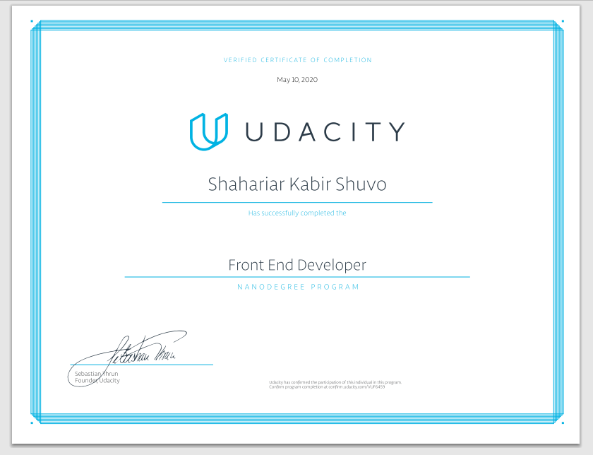

# UDACITY NANODEGREE PROGRAM - FRONT END WEB DEVELOPER

[Program Link](https://www.udacity.com/course/front-end-web-developer-nanodegree--nd0011)

# Front End Web Developer

Learn how to build high quality websites and dynamic applications to create stunning user experiences for the web.

The goal of the Front End Web Developer Nanodegree program is to equip learners with the unique skills they need to build and develop a variety of websites and applications. Graduates of this Nanodegree program will be able to construct responsive websites using CSS, Flexbox and CSS Grid, develop interactive websites and UI (User Interface) applications using JavaScript and HTML, and connect a web application to backend server data using JavaScript. Students will also build competency automating application build and deployment using Webpack and improving offline performance of websites using Service Worker.

## Project live link

[Project : 1 Landing Page](https://shahariarkabir.github.io/Udacity-Front-End-Developer-Nanodegree-Program/Project-1-travel-blog/)

[Project : 2 Landing Page](https://shahariarkabir.github.io/Udacity-Front-End-Developer-Nanodegree-Program/Project-2-Landing-Page-website/)

[Project-3-weather-journal](https://shahariarkabir.github.io/Udacity-Front-End-Developer-Nanodegree-Program/Project-3-weather-journal/website/)

[Project-4-natural-language-processing](https://shahariarkabir.github.io/Udacity-Front-End-Developer-Nanodegree-Program/Project-4-natural-language-processing/dist/)

[Project-7-travel-planner-app](https://shahariarkabir.github.io/Udacity-Front-End-Developer-Nanodegree-Program/Project-7-travel-planner-app/dist/)

# Certificate Link

[Udacity certificate ](https://confirm.udacity.com/VUF6459)

# Certificate of Completion

